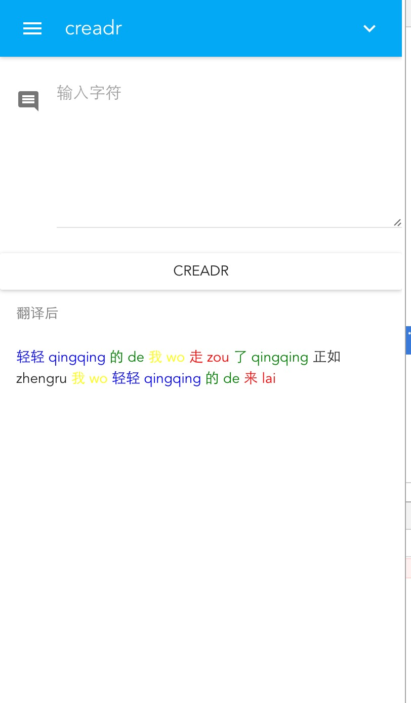

# creadr-demo

> A Vue.js project

## Build Setup

``` bash
# install dependencies
npm install

# serve with hot reload at localhost:8080
npm run dev

# build for production with minification
npm run build

# build for production and view the bundle analyzer report
npm run build --report
```

For detailed explanation on how things work, checkout the [guide](http://vuejs-templates.github.io/webpack/) and [docs for vue-loader](http://vuejs.github.io/vue-loader).

##Or you can just run this porject by
- fisrt run `  node prod.server.js `

- then click the button `creadr`
- the data returned and showed in a special way
- here is the screen shoot
- 

## Details
- Hardcoded mock data from `data.json`   
```
{
    "article": [
        {
            "word": "轻轻",
            "type": "a",
            "color": "blue",
            "pinyin": "qingqing"
        },    
        {
            "word": "的",
            "type": "u",
            "color": "green",
            "pinyin": "de"
        },    
        {
            "word": "我",
            "type": "r",
            "color": "yellow",
            "pinyin": "wo"
        },
        {
            "word": "走",
            "type": "v",
            "color": "red",
            "pinyin": "zou"
        },
        {
            "word": "了",
            "type": "u",
            "color": "green",
            "pinyin": "qingqing"
        },
        {
            "word": "正如",
            "type": "p",
            "pinyin": "zhengru"
        },
        {
            "word": "我",
            "type": "r",
            "color": "yellow",
            "pinyin": "wo"
        },
        {
            "word": "轻轻",
            "type": "a",
            "color": "blue",
            "pinyin": "qingqing"
        },
        {
            "word": "的",
            "type": "u",
            "color": "green",
            "pinyin": "de"
        },
        {
            "word": "来",
            "type": "v",
            "color": "red",
            "pinyin": "lai"
        }
    ]
}
```

- use vue2
